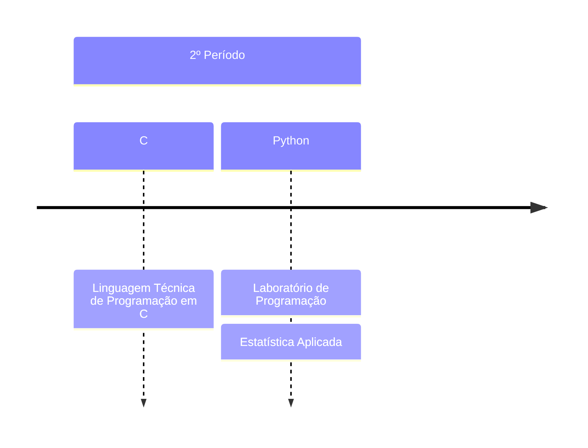

# UNIUBE
Repositório para projetos, exercícios e trabalhos realizados durante a graduação em sistemas de informação pela faculdade UNIUBE de Uberlândia.
---
## 2025 - 1
  1. [Linguagem Técnica de Programação em C](https://github.com/BorgesMTP/UNIUBE/tree/main/Linguagem%20T%C3%A9cnica%20de%20Programa%C3%A7%C3%A3o)
  2. [Laboratório de Programação](https://github.com/BorgesMTP/UNIUBE/tree/main/Linguagem%20T%C3%A9cnica%20de%20Programa%C3%A7%C3%A3o)
  3. [Estatística Aplicada](https://github.com/BorgesMTP/UNIUBE/tree/main/Estat%C3%ADstica%20Aplicada)

